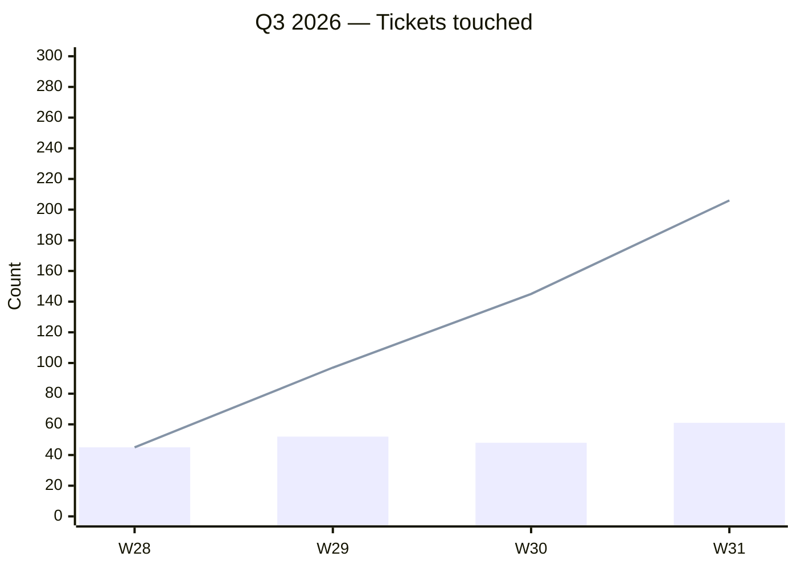

# Weekly Agent Log Schema (v1)

The contract for `weekly/{year}/{week}.md`. Written by weekly-note; read by the
status and monthly agents.

## Design rules

1. **Synthesize, don't concatenate.** Unlike the daily layer, this layer
   aggregates and deduplicates. One ticket appears once even if touched Monday
   and Thursday. One decision appears once even if echoed across meetings.
2. **Stable shape.** Every section appears in every file, in fixed order.
3. **Source citations.** Every synthesized item carries the date(s) it came from
   so downstream agents can trace back to the daily log.
4. **Ready-to-post drafts.** The Lattice and Geekbot sections are the final
   weekly drafts, synthesized across all five daily drafts. Label them clearly.

## Frontmatter

```yaml
---
schema_version: 1
type: weekly-agent-log
week: 2026-W26                          # ISO week label
week_start: 2026-06-22                  # Monday
week_end:   2026-06-26                  # Friday
timezone: America/Los_Angeles
generated_at: 2026-06-29T07:05:00-07:00
daily_logs_read: [2026-06-22, 2026-06-23, 2026-06-24, 2026-06-25, 2026-06-26]
daily_logs_missing: []                  # dates with no daily log found
counts:
  meetings: 0
  decisions: 0
  action_items_open: 0
  action_items_closed: 0
  tickets_touched: 0
  docs_touched: 0
entities:
  tickets:  []
  people:   []
  keywords: []
---
```

## Body sections (fixed order)

### `## tl;dr`
2–4 sentence factual orientation covering the week: dominant themes, major
outputs, key decisions, and notable blockers. Not a significance ranking.

### `## meetings`
All meetings from the week, one line each, ordered by date then time.
`- YYYY-MM-DD HH:MM-HH:MM | <title> | attendees: <name; name> | notes: <fellow_path|none> | outcome: <one factual clause> | actions: <AI-NNN; ...| none>`

### `## decisions`
All decisions from the week, deduplicated. If the same decision appears in
multiple daily logs, emit it once with all source dates.
`- <decision, factual> | context: <meeting or source> | date: <YYYY-MM-DD> | entities: <tags>`

### `## action_items`
All action items from the week. Mark completed ones if a later daily log shows
them done or if Jira evidence shows closure.
`- [ ] id:<AI-NNN> | owner:<name> | due:<YYYY-MM-DD|none> | source:<meeting|ticket|slack> | date:<YYYY-MM-DD> | <verbatim text>`
`- [x] id:<AI-NNN> | owner:<name> | completed:<YYYY-MM-DD> | <verbatim text>`

### `## ticket_activity`
One line per ticket touched during the week, summarizing all activity across days.
`- <DE-XXXX> | <actions: commented 2026-06-22; transitioned In Progress->Review 2026-06-24> | <summary of what happened> | <url>`

### `## doc_activity`
One line per page touched during the week, deduplicated across days.
`- <title> (<page_id>) | space:<KEY> | <created|edited> | dates: <YYYY-MM-DD; YYYY-MM-DD> | <what the page covers and what was worked on> | <url>`

### `## comms_highlights`
The most substantive Slack/email exchanges from the week, deduplicated.
`- <slack-dm|slack-channel|email> | <partner/subject> | with:<name; name> | date:<YYYY-MM-DD> | <full substance> | <url|none>`

### `## lattice_update`
Final weekly draft synthesized from all five daily `lattice_update` drafts.
Covers the full Mon–Fri window. Label as draft.

```
## lattice_update
> draft — review before posting to Lattice

**AI wins:**
<synthesized from the week's daily AI wins>

**Impact / highlights:**
<the most significant outcomes across the full week>

**Next week focus:**
<projected priorities based on open action items and project state>

**Blockers:**
<any unresolved blockers entering next week; _(none)_ if clear>

**Other:**
<anything else worth sharing with leadership>
```

### `## geekbot_em_update`
Final weekly draft for `#engineering-manager-updates`.

```
## geekbot_em_update
> draft — review before posting to #engineering-manager-updates

**What's one thing you learned or discovered this week?**
<specific insight from the week>

**Is anything blocking you or slowing you down?**
<unresolved blockers; _(none)_ if clear>

**What's your focus for the next few days?**
<near-term priorities>

**Anything you want to flag for the group?**
<cross-functional items, risks, or leadership flags>
```

### `## geekbot_tl_update`
Final weekly draft for `#tech-leaders-updates`.

```
## geekbot_tl_update
> draft — review before posting to #tech-leaders-updates

**Team execution capacity this week:**
<honest assessment of team bandwidth across the week>

**Team's top outcomes or deliverables this week:**
<specific completed or substantially advanced deliverables with ticket/doc references>

**Blockers affecting delivery, partner experience, or cross-functional alignment:**
<blockers; _(none)_ if clear>

**Anything slowing team execution:**
<impediments, resourcing gaps, or escalation needs>
```

### `## weekly_trend`
Rolling 4-week snapshot: the current week plus up to 3 prior weekly logs,
newest last. Current week row is bolded.

```
## weekly_trend
> Rolling 4-week snapshot

| Week    | Meetings | Decisions | AI Open | AI Closed | Tickets |
|---------|----------|-----------|---------|-----------|---------|
| W23     | 18       | 32        | 45      | 5         | 41      |
| W24     | 21       | 38        | 52      | 8         | 48      |
| W25     | 20       | 44        | 61      | 5         | 50      |
| **W26** | **23**   | **47**    | **69**  | **6**     | **57**  |
```

### `## q3_progress`
Cumulative Q3 tracker. Populated once `week_start >= quarter.start` in
`config.yaml`. Each row is one weekly log; columns show both the weekly value
and the running cumulative. The Mermaid chart overlays weekly bars with a
cumulative line.

```
## q3_progress
> Q3 2026 — Week 4 of 13

| Week    | AI Closed | Tickets | Meetings | ∑ AI Closed | ∑ Tickets |
|---------|-----------|---------|----------|-------------|-----------|
| W28     | 8         | 45      | 18       | 8           | 45        |
| W29     | 12        | 52      | 21       | 20          | 97        |
| W30     | 5         | 48      | 19       | 25          | 145       |
| **W31** | **9**     | **61**  | **22**   | **34**      | **206**   |


```

If the current week precedes `quarter.start`, render:
```
## q3_progress
> Q3 2026 starts 2026-07-01

_(not yet started)_
```

## Empty-section convention

```
## decisions
_(none)_
```
