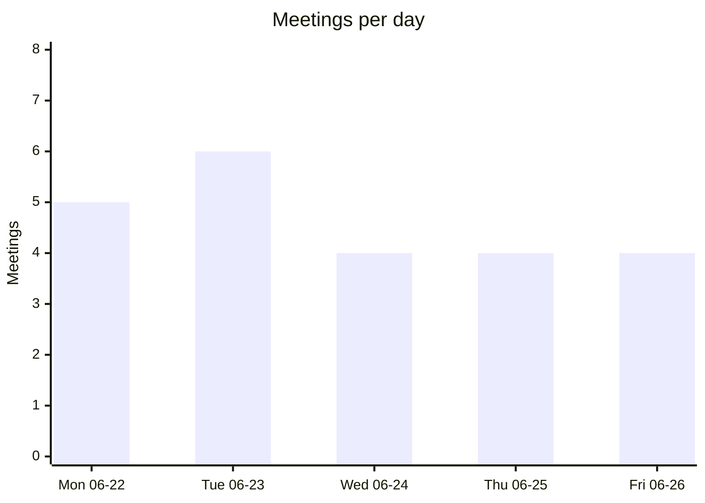
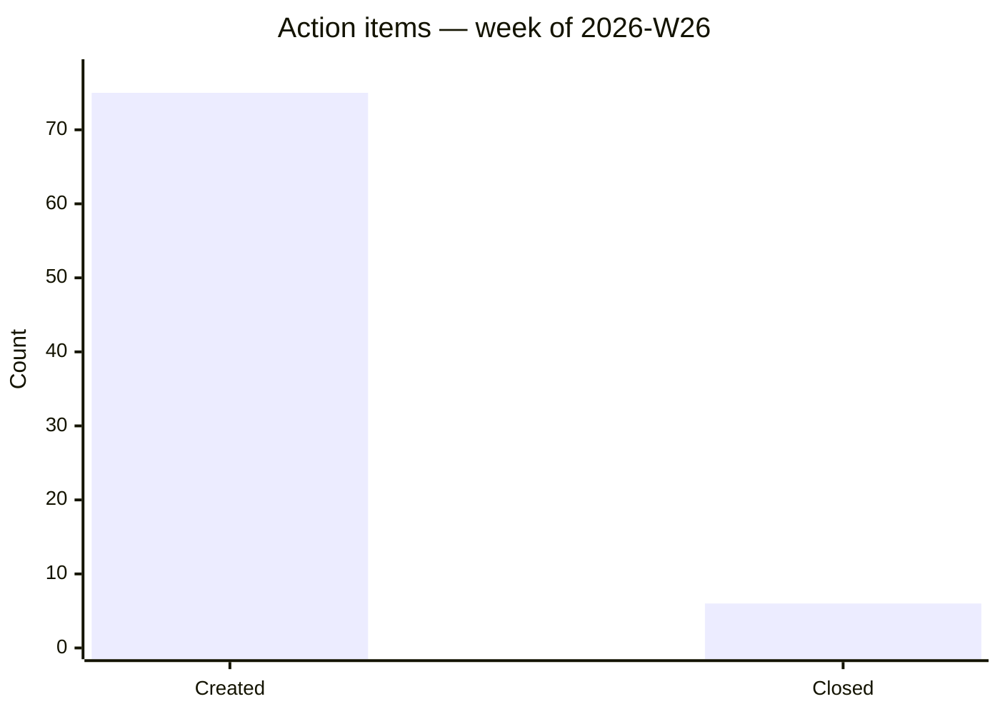
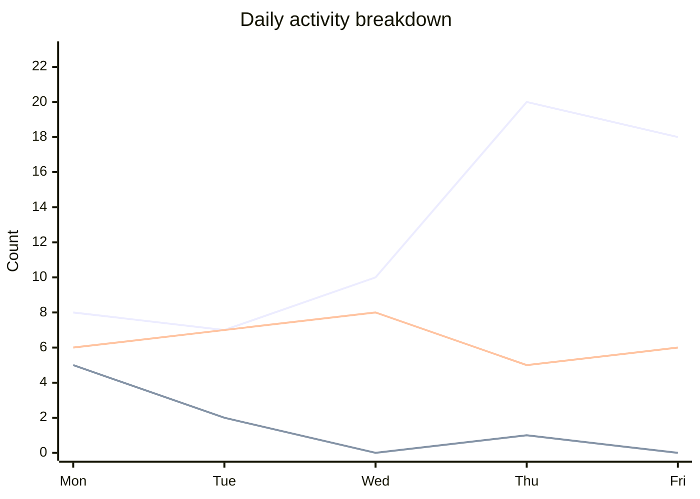

## tl;dr
W26 was a high-output week despite Dan and Brian both being OOO for significant stretches. Four major arcs: (1) **Release 3.0 deployed Tuesday** with advertiser reporting, tune table changes, DOB enrichment, and user data compliance; (2) **Unity Catalog naming and governance standards finalized** in a full-team review — Bronze/Silver/Gold/Metrics schema structure locked, comment requirements, snake_case, primary key, and constraint standards set for all go-forward Q3 work; (3) **Segment registry architecture reviewed and key decisions made** — mailable universe table as source, hash-only approach, single YAML file, two-job architecture (weekly refresh + daily new-segment build), with critical follow-up items requiring Virginia and Brian's confirmation on return; (4) **A two-year latent DOB bug fixed** — Venkatesh's PR #1779 recovered date-of-birth fill rate from 78% to 99% by adding try_cast for a long→string type mismatch in the FIG pipeline. The Q3 four-swim-lane structure (Core 80%, Reporting 2 devs, Audience Solutions 2 devs, Tech initiatives 20%) was communicated to the full team, and in-store advertising platform data architecture was designed (Kafka stream pattern, Cybage to implement).

## team_activity
_(team Jira data unavailable this week — no live Atlassian connector attached to this routine)_

## charts

### Meeting load

### Action item velocity

### Daily activity breakdown

_(legend: line 1 = tickets, line 2 = docs, line 3 = comms)_

## meetings
- 2026-06-22 06:05-07:00 | DE Sprint Retro and Planning | attendees: Dan Duling; Brian Silveri; Akhil Gonna; Bharat Gidwani; Joseph Melkin; Kapil Sreedharan; Vani Kaithi; Venkatesh Mannam; Granth S | notes: fellow/2026/2026-06-22/de-sprint-retro-and-planning.md | outcome: sprint started at 7 pts with reassignments; Q3 four-swim-lane Gantt structure presented; Cybage triaging process to be discussed tomorrow | actions: AI-001; AI-002; AI-003; AI-004; AI-005; AI-006
- 2026-06-22 07:00-07:30 | Weekly Audience Solutions Jira Prioritization | attendees: Virginia Marsh; Jean Carlo Camacho; Granth S; Manav Paul; Brian Silveri | notes: none | outcome: no transcript available | actions: none
- 2026-06-22 07:35-08:05 | Venkatesh x Trevor Sync | attendees: Venkatesh Mannam | notes: fellow/2026/2026-06-22/venkatesh-x-trevor-sync.md | outcome: advertiser table composite key decided; SCD-2 pattern adopted for NetSuite name history; all NetSuite to bronze; Lattice weekly updates introduced | actions: AI-007; AI-008; AI-009; AI-010
- 2026-06-22 08:30-09:00 | Kapil x Trevor Sync | attendees: Kapil Sreedharan | notes: fellow/2026/2026-06-22/kapil-x-trevor-sync.md | outcome: release most likely Tuesday; naming convention open question deferred | actions: none
- 2026-06-22 09:00-09:30 | Part 2: Review Updated to EA and UC Naming Guides | attendees: Brian Silveri; Bharat Gidwani; Manav Paul; Joseph Melkin; Granth S; Akhil Gonna; Venkatesh Mannam; Vani Kaithi; Kapil Sreedharan | notes: fellow/2026/2026-06-22/part-2-review-updated-to-ea-and-uc-naming-guides.md | outcome: Bronze/Silver/Gold/Metrics approved schemas locked; comments mandatory on Silver/Gold/Metrics; naming conventions finalized on go-forward basis | actions: AI-011; AI-012; AI-013
- 2026-06-23 09:05-09:30 | Cybage - DE team standup | attendees: Brian Silveri; Akhil Gonna; Bharat Gidwani; Kapil Sreedharan; Vani Kaithi; Venkatesh Mannam; Granth Sajjanshetty; Manav Paul; Cybage team | notes: fellow/2026/2026-06-23/cybage-de-team-standup.md | outcome: TAM 3.0 advertiser report (DE-1520) pushed to prod; vertical dimension held for v3.1; AppFlyer table naming finalized | actions: AI-001(Tue); AI-002(Tue); AI-003(Tue); AI-004(Tue); AI-005(Tue); AI-006(Tue)
- 2026-06-23 09:35-10:00 | DE Daily Standup | attendees: Dan Duling; Brian Silveri; Akhil Gonna; Bharat Gidwani; Kapil Sreedharan; Vani Kaithi; Venkatesh Mannam; Manav Paul; Granth Sajjanshetty | notes: fellow/2026/2026-06-23/de-daily-standup.md | outcome: no AI summary available | actions: none
- 2026-06-23 12:30-13:00 | Trevor <> Dan Check In | attendees: Dan Duling | notes: none | outcome: Dan OOO June 22-27; no decisions captured | actions: none
- 2026-06-23 14:00-15:00 | FluentU: Trevant Business Unit Overview (MANDATORY) | attendees: all-staff (~50+) | notes: none | outcome: no transcript; mandatory all-staff Trevant business unit overview | actions: none
- 2026-06-23 15:05-16:00 | Audience Solutions Segment Registry Review | attendees: Brian Silveri; Granth Sajjanshetty; Joseph Melkin; Manav Paul; Jean Carlo Camacho | notes: fellow/2026/2026-06-23/audience-solutions-segment-registry-review.md | outcome: PII masking added to Q3 scope; gold mailable universe as sole segment source; Phase 1 (platform) / Phase 2 (AI agents + UI) structure locked | actions: AI-007(Tue); AI-008(Tue); AI-009(Tue); AI-010(Tue); AI-011(Tue)
- 2026-06-23 16:05-16:30 | Fluent Advertiser (CBUR) Metric table review | attendees: Brian Silveri; Jason Warnock; Jose Pontes; Kapil Sreedharan; Bharat Gidwani | notes: fellow/2026/2026-06-23/fluent-advertiser-cbur-metric-table-review.md | outcome: Domo join performance confirmed; continue using Fluent Advertiser Performance table; campaign/advertiser/account manager dimensions to be added | actions: AI-012(Tue)
- 2026-06-24 09:35-10:00 | DE Daily Standup | attendees: Akhil Gonna; Bharat Gidwani; Kapil Sreedharan; Vani Kaithi; Venkatesh Mannam; Manav Paul; Granth Sajjanshetty | notes: fellow/2026/2026-06-24/de-daily-standup.md | outcome: Release 3.0 deployment day; DE-1567 and DE-1569 moved from 3.1; backfill job scheduling resolved | actions: AI-001(Wed); AI-002(Wed); AI-003(Wed)
- 2026-06-24 10:00-10:30 | Unified Tech Standup | attendees: Dan Duling; Jack Hall; Arbi Anjargholi; Dave Van Herten; Kapil Sreedharan; Akhil Gonna; Venkatesh Mannam; Vani Kaithi; Manav Paul; Rami Labana; Jean Carlo Camacho; Andrew Chalk; Granth Sajjanshetty | notes: fellow/2026/2026-06-24/unified-tech-standup.md | outcome: DE releasing advertiser reporting and tune table changes; Core targeting July 1 release; BI awaiting P1/P2 segmentation | actions: none
- 2026-06-24 10:30-11:00 | Joseph x Trevor Sync | attendees: Joseph Melkin | notes: fellow/2026/2026-06-24/joseph-x-trevor-sync.md | outcome: segment registry has critical gaps (PII, performance, output format); Virginia consultation required before implementation proceeds | actions: AI-004(Wed); AI-005(Wed)
- 2026-06-24 11:00-11:30 | In-store - Databricks Schema and Support | attendees: Jack Hall; Erin Manchester; Kapil Sreedharan; Rami Labana; Bharat Gidwani; Aaron Lupo | notes: fellow/2026/2026-06-24/in-store-databricks-schema-and-support.md | outcome: Kafka stream pattern confirmed; Cybage to implement; first Verifone tablets live Mon June 29 | actions: AI-006(Wed); AI-007(Wed); AI-008(Wed)
- 2026-06-25 09:05-09:30 | Cybage - DE team standup | attendees: Akhil Gonna; Bharat Gidwani; Kapil Sreedharan; Vani Kaithi; Venkatesh Mannam; Granth Sajjanshetty; Manav Paul | notes: fellow/2026/2026-06-25/cybage-de-team-standup.md | outcome: SCD Type 1 for advertiser/campaign tables; tune click conversion decommission approved; unified metrics view confirmed; DOT naming standard mandated | actions: AI-001(Thu)–AI-013(Thu)
- 2026-06-25 09:35-10:00 | DE Daily Standup | attendees: Dan Duling; Akhil Gonna; Bharat Gidwani; Kapil Sreedharan; Vani Kaithi; Venkatesh Mannam; Manav Paul; Granth Sajjanshetty | notes: fellow/2026/2026-06-25/de-daily-standup.md | outcome: no transcript available | actions: none
- 2026-06-25 11:30-12:00 | Manav x Trevor Sync | attendees: Manav Paul | notes: fellow/2026/2026-06-25/manav-x-trevor-sync.md | outcome: segment registry architecture finalized (mailable universe, single YAML, two-job architecture); several items pending Brian/Virginia confirmation | actions: AI-014(Thu)–AI-018(Thu)
- 2026-06-25 12:00-12:30 | Granth x Trevor Sync | attendees: Granth Sajjanshetty | notes: fellow/2026/2026-06-25/granth-x-trevor-sync.md | outcome: Audience Solutions prod will use medallion architecture with gold schema only (3 tables); model audience Phase 1 running successfully | actions: AI-019(Thu); AI-020(Thu)
- 2026-06-26 06:35-07:00 | DE Daily Standup | attendees: Dan Duling; Akhil Gonna; Kapil Sreedharan; Vani Kaithi; Venkatesh Mannam; Manav Paul; Joseph Melkin | notes: fellow/2026/2026-06-26/de-daily-standup.md | outcome: fluent performance blocker resolved via outer join; Tremendous missing campaigns reloaded; position views validated; UCM migration in progress | actions: AI-001(Fri)–AI-008(Fri)
- 2026-06-26 10:30-11:00 | Vani x Trevor Sync | attendees: Vani Kaithi | notes: fellow/2026/2026-06-26/vani-x-trevor-sync.md | outcome: position as dimension approach to be shown to Ryan first; sprint 14 backlog reviewed; PII masking blocked on DevOps group creation | actions: none
- 2026-06-26 11:00-11:30 | Akhil x Trevor Sync | attendees: Akhil Gonna | notes: fellow/2026/2026-06-26/akhil-x-trevor-sync.md | outcome: Tremendous payment calculation logic agreed; BU classifications duplication concern raised for Brian; Akhil to submit Lattice | actions: AI-009(Fri)–AI-012(Fri)
- 2026-06-26 12:30-12:45 | JC sync | attendees: Kapil Sreedharan; Jean Carlo Camacho; Venkatesh Mannam | notes: fellow/2026/2026-06-26/jc-sync.md | outcome: DOB bug identified (long→string mismatch, 78% fill rate since June 2024); Playful flows through Tune; dual source columns agreed; walkthrough with Kevin/Aaliyah scheduled Mon/Tue | actions: AI-013(Fri); AI-014(Fri)

## decisions
- Q3 work organized into four swim lanes: Core (80% of 6 devs), Reporting (2 devs), Audience Solutions (2 devs), Tech initiatives (20% protected floor); every sprint includes stories across all four lanes | context: DE Sprint Retro and Planning | date: 2026-06-22 | entities: Q3 Planning, Dan Duling
- Sprint capacity adjusted to 7 points: Bharat out 2 weeks, Manav out next week, Granth off June 26, Brian out Wed-Fri | context: DE Sprint Retro and Planning | date: 2026-06-22 | entities: Bharat Gidwani, Manav Paul, Granth Sajjanshetty
- Advertiser table primary key: composite key of source_advertiser_id + source_system_name | context: Venkatesh x Trevor Sync | date: 2026-06-22 | entities: Venkatesh Mannam, DE-1451
- NetSuite records without source IDs will use SCD-2 pattern (mark old rows inactive) when proper ID-based rows arrive | context: Venkatesh x Trevor Sync | date: 2026-06-22 | entities: Venkatesh Mannam
- All NetSuite data ingested into bronze tables comprehensively; silver and gold created only for immediate requirements | context: Venkatesh x Trevor Sync | date: 2026-06-22 | entities: Venkatesh Mannam
- Team will submit weekly updates in Lattice every Friday starting June 27 | context: Venkatesh x Trevor Sync | date: 2026-06-22 | entities: Venkatesh Mannam
- Release most likely Tuesday June 23; items not ready go into a separate new release | context: Kapil x Trevor Sync | date: 2026-06-22 | entities: Kapil Sreedharan
- Bronze/Silver/Gold/Metrics are the four approved schemas; any additional schema requires peer review and team approval | context: Part 2: Review Updated to EA and UC Naming Guides | date: 2026-06-22 | entities: Unity Catalog, Bharat Gidwani
- Table and column comments mandatory for Silver, Gold, and Metrics; Bronze optional; comments must be business-focused | context: Part 2: Review Updated to EA and UC Naming Guides | date: 2026-06-22 | entities: Unity Catalog
- UCM tables, online tables, and feature store tables live in Metrics schema; Gold contains only fact tables and entity-based dimension tables | context: Part 2: Review Updated to EA and UC Naming Guides | date: 2026-06-22 | entities: Unity Catalog
- New UC naming conventions apply go-forward only; existing legacy naming stays until formal migration plan developed | context: Part 2: Review Updated to EA and UC Naming Guides | date: 2026-06-22 | entities: Unity Catalog, centraldata_prod
- Volumes organized by medallion layer: ingestion sources in bronze schema, checkpoints in the schema where used | context: Part 2: Review Updated to EA and UC Naming Guides | date: 2026-06-22 | entities: Unity Catalog
- Primary keys use integer type when possible; constraints defined in Unity Catalog for lineage tracking; rely option on FK constraints for query optimization | context: Part 2: Review Updated to EA and UC Naming Guides | date: 2026-06-22 | entities: Unity Catalog
- Audit columns (created_at, updated_at) mandatory for Silver and Gold; bronze metadata column renamed _metadata (snake_case) | context: Part 2: Review Updated to EA and UC Naming Guides | date: 2026-06-22 | entities: Unity Catalog
- Vertical dimension change held for TAM v3.1; not included in current TAM 3.0 release | context: Cybage - DE team standup | date: 2026-06-23 | entities: Kapil Sreedharan, Venkatesh Mannam
- AppFlyer table names will spell out 'AppFlyer' in full (not 'AF'); Trevor has final naming convention sign-off | context: Cybage - DE team standup | date: 2026-06-23 | entities: Vani Kaithi
- Only email hashes (not full PII) sent to TU and LiveRamp for audience builds | context: Audience Solutions Segment Registry Review | date: 2026-06-23 | entities: Manav Paul, Jean Carlo Camacho, Q3 Planning
- Gold mailable universe table is the required source for all segment builds (post-FTC cleansed) | context: Audience Solutions Segment Registry Review | date: 2026-06-23; 2026-06-25 | entities: Jean Carlo Camacho, Q3 Planning
- PII masking implemented in Q3 for audience solutions dataset; new account manager role will not see raw PII | context: Audience Solutions Segment Registry Review | date: 2026-06-23 | entities: Q3 Planning
- Audience solutions analyst databricks group restricted to gold tables only (no bronze or silver) | context: Audience Solutions Segment Registry Review | date: 2026-06-23 | entities: Q3 Planning
- Segment registry platform (Phase 1) is prerequisite for AI agent work (Phase 2) | context: Audience Solutions Segment Registry Review | date: 2026-06-23 | entities: Manav Paul, Q3 Planning
- Jose continues using Fluent Advertiser Performance table as CBUR data source | context: Fluent Advertiser (CBUR) Metric table review | date: 2026-06-23 | entities: Kapil Sreedharan
- NetSuite ID will be the unifying campaign identifier across Fluent (Lead Manager and Pulse in Q3 first) | context: Fluent Advertiser (CBUR) Metric table review | date: 2026-06-23 | entities: Kapil Sreedharan, Q3 Planning
- Tickets DE-1567 (DOB enrichment) and DE-1569 (user data compliance) moved from Release 3.1 to Release 3.0 | context: DE Daily Standup | date: 2026-06-24 | entities: Kapil Sreedharan, Venkatesh Mannam
- Backfill job runs daily as temporary solution while offer events incremental process bug is investigated (DE-1619) | context: DE Daily Standup | date: 2026-06-24 | entities: Kapil Sreedharan, Venkatesh Mannam
- Virginia must be consulted before segment registry implementation proceeds; critical gaps in PII requirements, performance, output format, eligibility checks | context: Joseph x Trevor Sync | date: 2026-06-24 | entities: Joseph Melkin, Manav Paul
- Segment registry design was never peer-reviewed by the team; new norm: all new initiatives require inclusive planning meetings before implementation begins | context: Joseph x Trevor Sync | date: 2026-06-24 | entities: Joseph Melkin, Manav Paul, Dan Duling
- In-store platform event data pushed into Kafka streams following Pulse pattern; Databricks ingests from there | context: In-store - Databricks Schema and Support | date: 2026-06-24 | entities: Kapil Sreedharan, Rami Labana, Jack Hall
- Cybage team handles implementation of in-store data ingestion layer; Trevor and Kapil provide design guidance | context: In-store - Databricks Schema and Support | date: 2026-06-24 | entities: Kapil Sreedharan
- SCD Type 1 for advertiser and campaign dimension tables; option to add logging table if historical tracking needed | context: Cybage - DE team standup | date: 2026-06-25 | entities: DE-1511
- One unified metrics view for all business units rather than separate views per BU | context: Cybage - DE team standup | date: 2026-06-25 | entities: DE-1459, DE-1463
- Tune click conversion table decommissioning in single PR along with fact advertiser performance hourly repointing | context: Cybage - DE team standup | date: 2026-06-25 | entities: DE-1442
- Advertiser performance table moved from centraldata_prod to Fluentco metrics catalog (fluent_metrics_mv schema) | context: Cybage - DE team standup | date: 2026-06-25 | entities: DE-1453, centraldata_prod
- Segment registry will use mailable universe table as data source; post-FTC data; built-in underage/suppression checks | context: Manav x Trevor Sync | date: 2026-06-25 | entities: Manav Paul
- All segment definitions stored in a single YAML file updated incrementally | context: Manav x Trevor Sync | date: 2026-06-25 | entities: Manav Paul
- Two-job architecture for segment registry: weekly refresh job (Sunday nights) for existing audiences; daily morning job for new segment requests | context: Manav x Trevor Sync | date: 2026-06-25 | entities: Manav Paul
- Audience Solutions prod catalog follows medallion architecture; gold schema only with three tables: marketable users, survey summary, survey event | context: Granth x Trevor Sync | date: 2026-06-25 | entities: Granth Sajjanshetty
- Audience Solutions Jira board remains separate from DE board; segment creation transitions to account managers | context: Granth x Trevor Sync | date: 2026-06-25 | entities: Granth Sajjanshetty
- Fluent performance metrics view blocker resolved via outer join between Tune fact table (clicks/conversions) and Minion fact table (impressions) | context: DE Daily Standup | date: 2026-06-26 | entities: DE-1459, Kapil Sreedharan
- Position dimension redesign deferred until explicitly requested by Power BI/Kevin; current ticket proceeds to release as-is | context: DE Daily Standup; Vani x Trevor Sync | date: 2026-06-26 | entities: DE-1579, Vani Kaithi
- Tremendous payment calculation: filter failed and pending; sum executed amounts; subtract cancelled-succeeded refunds | context: Akhil x Trevor Sync | date: 2026-06-26 | entities: DE-1620, Akhil Gonna
- Playful data flows through Tune; no separate Playful source needed for advertiser dim table | context: JC sync | date: 2026-06-26 | entities: DE-1511, Jean Carlo Camacho
- Fluent advertiser dim table to include two source columns: traffic_source (Tune) and origination_source (Playful) | context: JC sync | date: 2026-06-26 | entities: DE-1511
- Engage downstream consumers (BI team: Kevin, Aaliyah) earlier in development to fill knowledge gaps | context: JC sync | date: 2026-06-26

## action_items
- [ ] id:AI-001 | owner:Brian Silveri | due:none | source:DE Sprint Retro and Planning | date:2026-06-22 | follow up with JC about resolving the tremendous campaign data blocker for gold rewards creation
- [x] id:AI-002 | owner:Granth Sajjanshetty | due:2026-06-22 | completed:2026-06-22 | source:DE Sprint Retro and Planning | add time off (Friday, June 26) to the shared calendar
- [ ] id:AI-003 | owner:Trevor Anderson | due:2026-06-23 | source:DE Sprint Retro and Planning | date:2026-06-22 | post a note in the chat about the assignment and triaging process for the Cybage team
- [ ] id:AI-004 | owner:Brian Silveri | due:none | source:DE Sprint Retro and Planning | date:2026-06-22 | create and assign discovery spikes for Q3 work, including reviewing Q3 epics and PRDs to draft TDD and discovery actions
- [ ] id:AI-005 | owner:Brian Silveri | due:2026-06-24 | source:DE Sprint Retro and Planning | date:2026-06-22 | schedule a segments planning meeting for Tuesday or Wednesday (June 23-24) with the team to review audience segment work before sprint end
- [ ] id:AI-006 | owner:Brian Silveri | due:none | source:DE Sprint Retro and Planning | date:2026-06-22 | follow up with DevSecOps and JC regarding open blockers for the team
- [ ] id:AI-007 | owner:Venkatesh Mannam | due:none | source:Venkatesh x Trevor Sync | date:2026-06-22 | confirm with Bharat whether source advertiser ID + source system name combination is unique across all source systems
- [ ] id:AI-008 | owner:Venkatesh Mannam | due:none | source:Venkatesh x Trevor Sync | date:2026-06-22 | create FPSO for NetSuite catalog and add to DevOps board to begin NetSuite data ingestion process
- [ ] id:AI-009 | owner:Venkatesh Mannam | due:2026-06-27 | source:Venkatesh x Trevor Sync | date:2026-06-22 | submit weekly updates in Lattice every Friday starting this Friday
- [ ] id:AI-010 | owner:Trevor Anderson | due:none | source:Venkatesh x Trevor Sync | date:2026-06-22 | follow up with Kapil regarding naming convention preference (source vs platform) for advertiser table columns
- [ ] id:AI-011 | owner:Trevor Anderson | due:none | source:Part 2: Review Updated to EA and UC Naming Guides | date:2026-06-22 | schedule meeting with Joseph, Manav, and Granth to review existing audience solutions design and evaluate how it maps to new medallion schema structure
- [ ] id:AI-012 | owner:Trevor Anderson | due:none | source:Part 2: Review Updated to EA and UC Naming Guides | date:2026-06-22 | set up conversation to discuss pattern for accessing S3 (volumes vs direct S3 access, external data sources)
- [ ] id:AI-013 | owner:Granth Sajjanshetty; Manav Paul; Joseph Melkin | due:none | source:Part 2: Review Updated to EA and UC Naming Guides | date:2026-06-22 | review code skills in the central data repo and copy to audience solutions repo if applicable
- [ ] id:AI-014 | owner:Trevor Anderson | due:none | source:DE Sprint Retro and Planning | date:2026-06-22 | continue following up with Griggs on open FDSO/DevSecOps blockers, particularly around audience solutions
- [x] id:AI-Tue-003 | owner:Vani Kaithi | due:2026-06-23 | completed:2026-06-23 | source:Cybage - DE team standup | post AppFlyer table names in the data engineering channel for naming convention review
- [ ] id:AI-Tue-004 | owner:Brian Silveri | due:none | source:Cybage - DE team standup | date:2026-06-23 | contact Jason Warnock to obtain the NetSuite API key for data ingestion
- [ ] id:AI-Tue-005 | owner:Brian Silveri | due:none | source:Cybage - DE team standup | date:2026-06-23 | share the minion report with Vani for validation of position and brand fields (DE-1579)
- [ ] id:AI-Tue-006 | owner:Brian Silveri | due:none | source:Cybage - DE team standup | date:2026-06-23 | schedule sync meeting with Kapil, Jason Warnock, Bharat, Trevor, and Russell to discuss MV Fluent performance metrics view architecture
- [ ] id:AI-Tue-007 | owner:Brian Silveri | due:none | source:Audience Solutions Segment Registry Review | date:2026-06-23 | follow up with Virginia, Dan, and Adrian to align on expectations for Phase 1 vs Phase 2 deliverables
- [ ] id:AI-Tue-008 | owner:Manav Paul | due:none | source:Audience Solutions Segment Registry Review | date:2026-06-23 | review the segment registry epic, ensure all stories are relevant and properly prioritized
- [ ] id:AI-Tue-009 | owner:Brian Silveri | due:none | source:Audience Solutions Segment Registry Review | date:2026-06-23 | set up discovery call with Virginia to discuss audience solutions UI reporting requirements
- [ ] id:AI-Tue-010 | owner:Manav Paul | due:none | source:Audience Solutions Segment Registry Review | date:2026-06-23 | follow up with Dan about Anthropic console account setup for AI agent testing
- [ ] id:AI-Tue-011 | owner:Trevor Anderson | due:none | source:Audience Solutions Segment Registry Review | date:2026-06-23 | push through DevOps permission requests for segment registry platform once Griggs completes current priority FTSOs
- [ ] id:AI-Tue-012 | owner:Brian Silveri | due:none | source:Fluent Advertiser (CBUR) Metric table review | date:2026-06-23 | add campaign, advertiser, and account manager name dimensions to Fluent Advertiser Performance table
- [ ] id:AI-Tue-013 | owner:Trevor Anderson | due:none | source:slack-groupdm | date:2026-06-23 | instruct team to copy FDSO links from Jira (not DevOps portal) when sharing blockers
- [ ] id:AI-Wed-001 | owner:Trevor Anderson | due:2026-06-24 | source:DE Daily Standup | date:2026-06-24 | review query changes for ticket DE-1182 (conversion mappings default to false when null)
- [ ] id:AI-Wed-002 | owner:Trevor Anderson | due:2026-06-24 | source:DE Daily Standup | date:2026-06-24 | follow up with Griggs on FDSO ticket for dev service principal access to S3 bucket for model audience validation
- [ ] id:AI-Wed-003 | owner:Venkatesh Mannam | due:none | source:DE Daily Standup | date:2026-06-24 | create bug ticket to investigate why offer events process is not properly backfilling fluent IDs, then decommission manual backfill job once fixed
- [ ] id:AI-Wed-004 | owner:Joseph Melkin | due:2026-06-24 | source:Joseph x Trevor Sync | date:2026-06-24 | draft and send email summary of all segment registry concerns and questions to Trevor for forwarding to Virginia
- [ ] id:AI-Wed-005 | owner:Trevor Anderson | due:2026-06-24 | source:Joseph x Trevor Sync | date:2026-06-24 | message Manov to schedule 30-minute walkthrough of segment registry architecture
- [ ] id:AI-Wed-006 | owner:Trevor Anderson | due:none | source:In-store - Databricks Schema and Support | date:2026-06-24 | fill out technical specifications ticket CFCM-39 with details on Kafka stream setup for in-store platform
- [ ] id:AI-Wed-007 | owner:Aaron Lupo | due:none | source:In-store - Databricks Schema and Support | date:2026-06-24 | send CFCM-39 to Trevor, Kapil, and Bharat for them to fill out with data ingestion details
- [ ] id:AI-Wed-008 | owner:Aaron Lupo | due:none | source:In-store - Databricks Schema and Support | date:2026-06-24 | schedule follow-up meeting to sync on remaining technical details for in-store platform
- [ ] id:AI-Wed-009 | owner:Trevor Anderson | due:2026-06-24 | source:email FDSO-468 | date:2026-06-24 | monitor FDSO-468 progress — SM Fahmid handling in Griggs' absence
- [ ] id:AI-Thu-001 | owner:Granth Sajjanshetty | due:none | source:Cybage - DE team standup | date:2026-06-25 | update FDSO to reflect corrected S3 bucket naming convention (Audience Solutions def)
- [ ] id:AI-Thu-002 | owner:Trevor Anderson | due:none | source:Cybage - DE team standup | date:2026-06-25 | check on model audience S3 bucket creation with SM and loop in Joseph
- [ ] id:AI-Thu-003 | owner:Kapil Sreedharan | due:none | source:Cybage - DE team standup | date:2026-06-25 | analyze and design how to combine event tables into a unified fact table powering Fluent metrics view across all BUs
- [ ] id:AI-Thu-004 | owner:Akhil Gonna | due:none | source:Cybage - DE team standup | date:2026-06-25 | reconcile Tremendous campaign payment amounts with source platform fulfillment costs by mapping campaign names
- [ ] id:AI-Thu-005 | owner:Akhil Gonna | due:none | source:Cybage - DE team standup | date:2026-06-25 | create placeholder ticket for gold campaign minion table null fields issue to refine when Brian returns
- [ ] id:AI-Thu-006 | owner:Kapil Sreedharan | due:none | source:Cybage - DE team standup | date:2026-06-25 | update NetSuite IT ticket in blocked section of JIRA with current status and tracking information
- [ ] id:AI-Thu-007 | owner:Venkatesh Mannam | due:none | source:Cybage - DE team standup | date:2026-06-25 | add FDSO for creating new catalog to ticket DE-1612 for tracking purposes
- [ ] id:AI-Thu-008 | owner:Trevor Anderson | due:none | source:Cybage - DE team standup | date:2026-06-25 | review with team and add details to subtasks for table migrations and source specifications (DE-1453)
- [ ] id:AI-Thu-009 | owner:Manav Paul | due:none | source:Cybage - DE team standup | date:2026-06-25 | create ticket for Lotta May cross-account access setup and coordinate on instance profile configuration
- [ ] id:AI-Thu-010 | owner:Bharat Gidwani | due:none | source:Cybage - DE team standup | date:2026-06-25 | check if campaign corruption issue in campaign ref table resolved with yesterday's release
- [ ] id:AI-Thu-011 | owner:Bharat Gidwani | due:none | source:Cybage - DE team standup | date:2026-06-25 | analyze Tremendous campaigns in dev catalog to determine how they map to Pulse and Lead Manager
- [ ] id:AI-Thu-012 | owner:Kapil Sreedharan | due:none | source:Cybage - DE team standup | date:2026-06-25 | create ticket to review all fact tables and determine if data regeneration needed due to mapping rule changes
- [ ] id:AI-Thu-013 | owner:Kapil Sreedharan | due:none | source:Cybage - DE team standup | date:2026-06-25 | set up time with Trevor to discuss fact tables review internally
- [ ] id:AI-Thu-014 | owner:Manav Paul | due:none | source:Manav x Trevor Sync | date:2026-06-25 | confirm with Virginia and TransUnion whether hash-only data approach is viable for proper audience performance on Data Marketplace
- [ ] id:AI-Thu-015 | owner:Manav Paul | due:none | source:Manav x Trevor Sync | date:2026-06-25 | check with Brian and Dan on file format preference (one file per segment vs one row per user) and confirm with TransUnion/LiveRamp/Lotame
- [ ] id:AI-Thu-016 | owner:Manav Paul | due:none | source:Manav x Trevor Sync | date:2026-06-25 | confirm minimum segment eligibility threshold with Brian and Dan (current: 1M records, proposed: 5K records)
- [ ] id:AI-Thu-017 | owner:Manav Paul | due:none | source:Manav x Trevor Sync | date:2026-06-25 | follow up with Brian and Virginia on open segment registry questions once they return from time off
- [ ] id:AI-Thu-018 | owner:Manav Paul | due:none | source:Manav x Trevor Sync | date:2026-06-25 | create Confluence doc on standardized JIRA ticket format for audience solutions (required fields: destinations, credentials, rate, cost)
- [ ] id:AI-Thu-019 | owner:Granth Sajjanshetty | due:2026-06-27 | source:Granth x Trevor Sync | date:2026-06-25 | document specific tables required by analytics team (Virginia, Monisha, new account manager) for Audience Solutions analytical work
- [x] id:AI-Thu-020 | owner:Granth Sajjanshetty | due:2026-06-25 | completed:2026-06-25 | source:Granth x Trevor Sync | complete the weekly Lattice update before end of day Friday
- [ ] id:AI-Fri-001 | owner:Venkatesh Mannam | due:none | source:DE Daily Standup | date:2026-06-26 | validate that all campaigns and advertisers from Pulse (including Minion and Playful Rewards) are present in the gold advertiser and gold campaign tables
- [ ] id:AI-Fri-002 | owner:Venkatesh Mannam | due:none | source:DE Daily Standup | date:2026-06-26 | validate advertiser list against Pulse creative reporting dashboard (160 advertisers)
- [ ] id:AI-Fri-003 | owner:Kapil Sreedharan | due:none | source:DE Daily Standup | date:2026-06-26 | perform validation testing on fluent performance metrics view after outer join solution
- [ ] id:AI-Fri-004 | owner:Akhil Gonna | due:none | source:DE Daily Standup | date:2026-06-26 | create documentation for Tremendous (orders and campaigns) with JC and Sharita as points of contact
- [ ] id:AI-Fri-005 | owner:Akhil Gonna | due:none | source:DE Daily Standup | date:2026-06-26 | get count of how many Tremendous campaigns successfully matched vs unmatched using fuzzy logic
- [ ] id:AI-Fri-006 | owner:Venkatesh Mannam | due:2026-06-26 | source:DE Daily Standup | date:2026-06-26 | complete testing of UCM migration for Gold Ad group conversions and send to Chalky for review
- [x] id:AI-Fri-007 | owner:Kapil Sreedharan | due:2026-06-26 | completed:2026-06-26 | source:DE Daily Standup | follow up with IT team by noon regarding pending NetSuite API access request
- [ ] id:AI-Fri-008 | owner:Manav Paul | due:none | source:DE Daily Standup | date:2026-06-26 | send the job link for the declared audience delivery pipeline test to Trevor for review
- [ ] id:AI-Fri-009 | owner:Akhil Gonna | due:none | source:Akhil x Trevor Sync | date:2026-06-26 | discuss Tremendous payment status logic with Brian once he returns to confirm filter/subtraction approach
- [ ] id:AI-Fri-010 | owner:Akhil Gonna | due:none | source:Akhil x Trevor Sync | date:2026-06-26 | check Playful rewards data to compare and validate fulfillment records against Tremendous data
- [ ] id:AI-Fri-011 | owner:Akhil Gonna | due:none | source:Akhil x Trevor Sync | date:2026-06-26 | check with Brian on Monday about event mapping ticket and BU classifications table to avoid duplicating existing data
- [x] id:AI-Fri-012 | owner:Akhil Gonna | due:2026-06-26 | completed:2026-06-26 | source:Akhil x Trevor Sync | submit Lattice summary today
- [ ] id:AI-Fri-013 | owner:Venkatesh Mannam | due:none | source:JC sync | date:2026-06-26 | create bug ticket for the date of birth pipeline issue (long→string mismatch since June 2024, 78% fill rate, backfill required)
- [ ] id:AI-Fri-014 | owner:Jean Carlo Camacho | due:2026-06-30 | source:JC sync | date:2026-06-26 | schedule walkthrough with Kevin, Aaliyah, Venkatesh, and team for Mon/Tue to review advertiser dimension table design
- [ ] id:AI-Fri-015 | owner:Trevor Anderson | due:none | source:email | date:2026-06-26 | review and merge DE-1628 PR #1779 (Venkatesh's DOB fix — try_cast for DOB fields to handle ANSI mode)
- [ ] id:AI-Fri-016 | owner:Trevor Anderson | due:none | source:slack-dm | date:2026-06-26 | confirm GLP-1 segment permission error resolution — Prod SP needs read access to audience_solutions catalog; fix for Monday
- [ ] id:AI-Fri-017 | owner:Trevor Anderson | due:2026-06-30 | source:slack-dm | date:2026-06-26 | follow up on NetSuite API access (Kapil's IT request) if still no response by Monday

## ticket_activity
- DE-961 | DevOps working on foreign catalog setup (AWS Glue / Hive metastore via instance profile) | 2026-06-26 | https://fluentco.atlassian.net/browse/DE-961
- DE-1182 | fix defaults when null for conversion mappings; bug ticket closed by Akhil | commented 2026-06-24 | https://fluentco.atlassian.net/browse/DE-1182
- DE-1187 | Akhil: 40 of 71 Tremendous campaign IDs missing from reference table flagged to JC; campaigns reloaded 2026-06-26 by JC+Sharita with fuzzy matching | active 2026-06-24; 2026-06-25 | https://fluentco.atlassian.net/browse/DE-1187
- DE-1442 | Tune click conversion decommission; Bharat has PR to change source table pointer; single-PR approach agreed 2026-06-25 | active 2026-06-25 | https://fluentco.atlassian.net/browse/DE-1442
- DE-1451 | Venkatesh: PF changes reviewed by Kapil, adding status flags; fix version set to CDP v3.0.31; app engine and position views code changes completed by Vani; ready for review | worklog Mon; field update Tue; active Thu; in-review Fri | https://fluentco.atlassian.net/browse/DE-1451
- DE-1453 | Advertiser performance table migration from centraldata_prod to fluent_metrics_mv schema; subtasks need detail from Trevor | active 2026-06-25; 2026-06-26 | https://fluentco.atlassian.net/browse/DE-1453
- DE-1454 | Analysis of BU event mapping table; Akhil and Bharat found similar to existing BU classification table; discussion scheduled; potential duplication concern raised 2026-06-26 | active 2026-06-25 | https://fluentco.atlassian.net/browse/DE-1454
- DE-1458 | Bharat Pamnani (Cybage): asked Kapil for input on mapping rules | commented 2026-06-23 | https://fluentco.atlassian.net/browse/DE-1458
- DE-1459 | CBUR Build Production Metrics View; outer join (Tune + Minion fact tables) resolves Shubham's blocker; draft PR created by Kapil 2026-06-26 | blocked Thu; resolved Fri | https://fluentco.atlassian.net/browse/DE-1459
- DE-1463 | CBUR Playful Rewards union branch; unblocked by same outer join solution as DE-1459; remains In Review; dependent on advertiser/campaign completeness validation | blocked Thu; active Fri | https://fluentco.atlassian.net/browse/DE-1463
- DE-1511 | Gold Fluent Campaign Table; SCD Type 1 confirmed 2026-06-25; dual source columns (traffic_source + origination_source) agreed 2026-06-26; validation against Pulse dashboard required | active throughout week | https://fluentco.atlassian.net/browse/DE-1511
- DE-1531 | Migrate gold_adgroup_conversions to UCM; Venkatesh adding partner type dimension; DS team confirmed EPC metric only (acceptable difference) | in-progress 2026-06-26 | https://fluentco.atlassian.net/browse/DE-1531
- DE-1550 | Exploration complete; Granth to create follow-up ticket for migration piece | transitioned 2026-06-22 | https://fluentco.atlassian.net/browse/DE-1550
- DE-1554 | Databricks governance model; David Grigoli granted metastore admin access; Active Group Inventory and Grants page published; Blocked pending DevOps group creation for PII masking | active Mon-Fri | https://fluentco.atlassian.net/browse/DE-1554
- DE-1566 | Segments planning to be scheduled (Brian) for audience solutions Q3 planning | worklog 2026-06-22 | https://fluentco.atlassian.net/browse/DE-1566
- DE-1567 | DOB age enrichment; moved from Release 3.1 to Release 3.0; Done 2026-06-24; 443M records affected | transitioned Done 2026-06-24 | https://fluentco.atlassian.net/browse/DE-1567
- DE-1577 | CBUR AppsFlyer Playful tables ingestion; Vani validated against Minion report; attached to next release 2026-06-26 | worklog Mon; in-review Fri | https://fluentco.atlassian.net/browse/DE-1577
- DE-1579 | Position view for Advertiser Report; validated by Vani 2026-06-26; attached to next release; position-as-dimension redesign deferred pending Ryan validation | active Thu; in-review Fri | https://fluentco.atlassian.net/browse/DE-1579
- DE-1589 | NetSuite API access IT ticket; Jason raised IT ticket; Trevor commented 2026-06-24; no IT response as of Fri; Kapil following up | commented 2026-06-24; active 2026-06-26 | https://fluentco.atlassian.net/browse/DE-1589
- DE-1601 | Bug ticket for column default changes; created during sprint planning (1 pt) | created 2026-06-22 | https://fluentco.atlassian.net/browse/DE-1601
- DE-1603 | Q3 tech initiative epic — governance model formalization (Trevor) | created 2026-06-22 | https://fluentco.atlassian.net/browse/DE-1603
- DE-1604 | Q3 tech initiative epic — Unity Catalog naming conventions and governance | created 2026-06-22; blocked (playful_rewards_prod access needed) 2026-06-26 | https://fluentco.atlassian.net/browse/DE-1604
- DE-1605 | Q3 tech initiative epic (Trevor) | created 2026-06-22 | https://fluentco.atlassian.net/browse/DE-1605
- DE-1612 | Model audience / audience solutions pipeline; PII masking PR in progress; Granth reviewing PRs; FDSO for new catalog to be added | in-progress 2026-06-25 | https://fluentco.atlassian.net/browse/DE-1612
- DE-1613 | Update backfill job to run daily 7am EST — Done | transitioned Done 2026-06-24 | https://fluentco.atlassian.net/browse/DE-1613
- DE-1615 | Merged into dev (Granth) | commented 2026-06-23 | https://fluentco.atlassian.net/browse/DE-1615
- DE-1619 | Bug: fold fluent_id backfill into Minion_Offer_Events as daily-windowed task; created by Venkatesh 2026-06-24; 4-day lookback window added to offer events pipeline; in review | created 2026-06-24; in-progress 2026-06-25 | https://fluentco.atlassian.net/browse/DE-1619
- DE-1620 | Create Tremendous Campaign table; created by Akhil 2026-06-24; missing campaigns reloaded by JC+Sharita 2026-06-26; Closed - Not Done | created 2026-06-24; closed 2026-06-26 | https://fluentco.atlassian.net/browse/DE-1620
- DE-1621 | Gold email job failed at IG API due to weak dedupe logic; Venkatesh added extra dedupe fix; in review | created 2026-06-25 | https://fluentco.atlassian.net/browse/DE-1621
- DE-1627 | Repoint Declared Audiences vendor staging; Joseph created PR 1627 2026-06-26 to repoint extract task to new staging path | in-review 2026-06-26 | https://fluentco.atlassian.net/browse/DE-1627
- DE-1628 | FIG DOB pipeline bug (LongType→string mismatch since June 2024, 78% fill rate); PR #1779 opened by Venkatesh, approved by Kapil, merged 2026-06-26; DOB fill rate recovered to 99% | created and merged 2026-06-26 | https://fluentco.atlassian.net/browse/DE-1628
- CFCM-39 | In-store platform data ingestion; Trevor/Bharat/Kapil added Kafka stream approach notes for Aaron Lupo 2026-06-24; persona group creation in progress 2026-06-25 | commented 2026-06-24; active 2026-06-25 | https://fluentco.atlassian.net/browse/CFCM-39
- FDSO-510 | Foreign Catalog Databricks — AWS Glue; DevOps working on it per 2026-06-26; Waiting for customer | active 2026-06-26 | https://fluentco.atlassian.net/browse/FDSO-510
- FDSO-520 | Model audience S3 bucket creation; code already implements correct naming convention; Trevor following up with SM | active 2026-06-25 | https://fluentco.atlassian.net/browse/FDSO-520
- FDSO-523 | Audience Solutions catalog creation; Venkatesh created; Gregory working on it | active 2026-06-25 | https://fluentco.atlassian.net/browse/FDSO-523
- FDSO-528 | Dev S3 buckets created for model audience testing; TransUnion and LiveRamp locations available; Lotta May cross-account requires separate setup | active 2026-06-25 | https://fluentco.atlassian.net/browse/FDSO-528
- GRU-7251 | NetSuite IT ticket; Kapil to update with current status | active 2026-06-25 | https://fluentco.atlassian.net/browse/GRU-7251
- GRU-7877 | Traffic Source ID on Offer Session Event for Databricks ingestion; all QA checks passed per Benjamin Collins 2026-06-24 | QA passed 2026-06-24 | https://fluentco.atlassian.net/browse/GRU-7877

## doc_activity
- UC Naming Guide / EA Naming Guide (4731699203) | space:DOT | edited | dates: 2026-06-22 | Finalized Unity Catalog naming standards: Bronze/Silver/Gold/Metrics schema structure, comment requirements (Silver/Gold/Metrics mandatory, business-focused), snake_case column naming, fact/dim prefix conventions, version suffix lifecycle policy, cluster-by-auto recommendation, retention policy guidance, volume organization by medallion layer, audit column requirements, primary key integer preference, constraint and rely option standards | https://fluentco.atlassian.net/wiki/spaces/DOT/pages/4731699203
- Fluent Advertiser Table Design (4731535387) | space:DOT | edited | dates: 2026-06-22 | Updated with composite key decision (source_advertiser_id + source_system_name), SCD-2 pattern for name history, NetSuite null source ID fallback logic, FPSO requirement for NetSuite catalog | https://fluentco.atlassian.net/wiki/spaces/DOT/pages/4731535387
- Q3 Planning — DE Swim Lanes and Gantt (4728193052) | space:DOT | edited | dates: 2026-06-22 | Q3 four-swim-lane structure documented: Core (ROAS phase 2, in-store incentives, identity graph to rewards, Fluentco one data ingestion pipeline), Reporting, Audience Solutions, Tech initiatives (20% floor); cross-team dependency sequencing for Don presentation | https://fluentco.atlassian.net/wiki/spaces/DOT/pages/4728193052
- NetSuite Schema Documentation (4725762050) | space:DOT | viewed | dates: 2026-06-22 | Kapil-shared NetSuite customer/advertiser table schema showing internal linkings across Lead Manager, Tune, Minion; used during Venkatesh sync to evaluate column naming and composite key design | https://fluentco.atlassian.net/wiki/spaces/DOT/pages/4725762050
- Audience Solutions Migration Plan (4726581259) | space:DOT | edited | dates: 2026-06-22 | Audience solutions catalog migration planning; malleable_universe and livermdf schemas evaluated against new medallion structure; gold marketable universe table to live in Fluent catalog; Live Ramp/Transunion/Lotame tables identified as platinum-level | https://fluentco.atlassian.net/wiki/spaces/DOT/pages/4726581259
- Active Group Inventory and Grants (DE-1554) (4742283301) | space:DOT | edited | dates: 2026-06-23; 2026-06-25 | Live inventory of active Databricks Unity Catalog groups and grants; documents functional/persona groups and workspace-scoped groups with grant counts, distinct objects, and effective access levels; flags naming inconsistency in Audience Solutions workspace groups and cleanup candidates | https://fluentco.atlassian.net/wiki/spaces/DOT/pages/4742283301
- Databricks Unity Catalog Governance - Phase 1 (4741496843) | space:DOT | edited | dates: 2026-06-23 | Phase 1 governance framework page; companion to Active Group Inventory page; part of Trevor's Q3 tech initiative for governance model formalization | https://fluentco.atlassian.net/wiki/spaces/DOT/pages/4741496843

## pr_activity
_(PR data from daily logs only — no live GitHub or Atlassian connector attached to this routine)_
- centraldata_ingestion | PR #1779 "FIG DOB fix — try_cast for DOB fields to handle ANSI mode" | opened 2026-06-26, merged 2026-06-26 | author: Venkatesh Mannam | reviewers: Kapil Sreedharan (approved), GitHub Copilot | fixes long→string type mismatch causing DOB nulls since June 2024; DOB fill rate recovered to 99% | none
- centraldata_ingestion | PR #1627 "Repoint Declared Audiences vendor staging to per-environment catalog buckets" | opened 2026-06-26, still open | author: Joseph Melkin | unblocks Manav's delivery task work | https://fluentco.atlassian.net/browse/DE-1627
- centraldata_ingestion | PR #1748 "SCD-2 for fluent advertiser table" | in review as of 2026-06-23 | author: Venkatesh Mannam | Bharat reviewing comments; most resolved; SCD type decision ultimately reversed to Type 1 on 2026-06-25 | none
- centraldata_ingestion | PRs #1749, #1752, #1753, #1754, #1755, #1756, #1757 | posted for review 2026-06-23 | multiple authors (Bharat Pamnani, Venkatesh Mannam) | AppFlyer, advertiser table, compliance purge, documentation updates per 2026-06-23 comms | none

## comms_highlights
- slack-dm | David Grigoli — FDSO 468 + Databricks metastore admin | with:David Grigoli | Trevor received metastore admin access; confirmed single metastore across all workspaces; Databricks has no read-only admin mode (flagged as product suggestion); David confirmed all metastore changes now managed via Terraform — manual changes may be overwritten; FDSO-468 unblocked via SM Fahmid covering for Griggs | date: 2026-06-22; 2026-06-23; 2026-06-24 | none
- slack-channel | #data-engineering-core-team — AppFlyer table naming | with:Vani Kaithi; Kapil Sreedharan; Brian Silveri | Vani posted AppFlyer table naming question; Trevor provided API endpoints; table names finalized as appsflyer_agg_events and appsflyer_app_user_events | date: 2026-06-23 | https://grid-fluentco.enterprise.slack.com/archives/C08QK8ZQ1UZ/p1782222070247169
- slack-groupdm | Bharat/Kapil/Akhil/Venkatesh/Vani — SCD type consistency | with:Bharat Gidwani; Kapil Sreedharan; Akhil Gonna; Venkatesh Mannam; Vani Kaithi | SCD Type 2 vs Type 1 debate for Fluent dims; DE-1614 ticket and PR 1755 created by Bharat; multiple PRs posted (1749, 1752, 1753, 1754, 1756, 1757); SCD Type 1 ultimately confirmed on 2026-06-25 | date: 2026-06-23 | none
- slack-groupdm | Trevor/David Grigoli/SM Fahmid — FDSO-468 unblocking | with:David Grigoli | SM Fahmid stepped in while David unavailable; Trevor confirmed forward progress on FDSO-468 and FDSO-518 via Zoom; model audience validation unblocked | date: 2026-06-24 | none
- slack-dm | Manav Paul — segment registry architecture walkthrough | with:Manav Paul | Manav provided service principal name needed for FDSO request (audience_solutions_github_actions_dev); Trevor confirmed o&o catalog privilege not needed; architecture walkthrough call | date: 2026-06-24 | none
- slack-groupdm | Kapil/Karen/Trevor — BI label tracking alignment | with:Kapil Sreedharan; Karen Valle | Agreed to call out BI labels (BI Q2.04A) in release notes; Karen to be directly pinged when DE advances advertiser report or cross-BU report tickets | date: 2026-06-24 | none
- slack-dm | Venkatesh Mannam — DOB backfill success | with:Venkatesh Mannam | Venkatesh asked for QC on DOB backfill run post-PR merge; shared Databricks job links; DOB fill rate confirmed at 99% — "amazing news" | date: 2026-06-26 | none
- slack-groupdm | Bharat/Kapil/Venkatesh — GLP-1 segment permission error | with:Bharat Pamnani; Kapil Sreedharan; Venkatesh Mannam | Prod SP lacks USE CATALOG on audience_solutions_dev; Kapil confirmed no downstream currently uses GLP-1 segment; using previous version data as workaround; fix scheduled for Monday | date: 2026-06-26 | none

## lattice_update
> draft — review before posting to Lattice

**AI wins:**
Daily-note Cloud Routine running unattended all week — generated all five daily logs automatically while laptop was closed. Claude code skills in central_data repo enable AI-assisted adherence to UC naming standards (team recommended Audience Solutions team copy them). Segment registry Phase 2 work (AI agent for segment auto-suggestion) is in early development by Manav — basic first draft built, blocked on DevOps permissions and Anthropic console account. DOB data quality issue surfaced because Kevin's BI dashboard showed high skip rate — AI-assisted dashboard visibility is actively exposing historical data quality gaps.

**Impact / highlights:**
Release 3.0 deployed Tuesday (June 24) — advertiser reporting tables, tune table changes, DE-1567 (DOB enrichment of 443M records), DE-1569 (user data compliance). Unity Catalog naming and governance standards finalized for all go-forward Q3 development — Bronze/Silver/Gold/Metrics schema structure, comment requirements, snake_case, audit columns, primary key standards, volume organization locked in a full-team review. DOB fill rate recovered from 78% to 99% after Venkatesh's PR #1779 fixed a two-year latent long→string type mismatch in the FIG pipeline. Q3 four-swim-lane structure communicated to full team with Gantt visualization — Brian will present to Don for priority sequencing decisions. Segment registry architecture reviewed and key technical decisions made (mailable universe source, hash-only approach, single YAML file, two-job architecture). In-store advertising platform data architecture agreed with Aaron Lupo (Kafka stream pattern, Cybage to implement, first Verifone tablets live June 29).

**Next week focus:**
Fix GLP-1 segment permission error (audience_solutions_dev catalog access for Prod SP). Attend advertiser dim table walkthrough with Kevin/Aaliyah/JC (Mon/Tue). Segment registry open questions with Brian/Virginia on return: hash-only approach confirmation, file format, minimum eligibility threshold. Fact table review with Kapil to assess data regeneration needs. Model audience polling strategy review (constant connection vs 30-min check job). NetSuite API escalation to IT if no response. Audience Solutions Analyst persona group creation with David once Granth's analytics table documentation complete.

**Blockers:**
NetSuite API access pending IT approval (blocking CBUR gold advertiser table completeness and NetSuite ID joins). PII masking GitHub workflow blocked on DevOps creating Okta-managed access group. Foreign catalog setup (FDSO-510) in progress with DevOps — blocking JC data access workflow. Segment registry pending Virginia/TransUnion confirmation on hash-only approach. Tremendous campaign mapping gap (40 of 71 IDs, JC engaging Tremendous team directly). Brian OOO until Monday.

**Other:**
Sprint capacity reduced to 7 pts with multiple OOOs — Bharat out 2 weeks, Manav out next week (June 29-July 7), Granth off June 26, Brian out Wed-Fri. Trevor out week of July 6. Reduced capacity next week: Canada Day (July 1) and US Independence Day (July 2-3). Team outing to Toronto being considered for later in summer. HR noted DE team is ahead of rest of Fluentco on quality of internal communication and updates.

## geekbot_em_update
> draft — review before posting to #engineering-manager-updates

**What's one thing you learned or discovered this week?**
Two things worth flagging: (1) The FIG DOB pipeline had been silently dropping date-of-birth data since June 2024 — nearly two years — because the source switched from long to string format but our pipeline still expected long. This surfaced only because Kevin's new BI dashboard showed a high skip rate. Increased dashboard visibility is actively exposing historical data quality issues we didn't know we had. (2) TransUnion actively attempts to reconstruct Fluentco's identity graph from data we share with them — the hash-only approach for the segment registry is a deliberate strategic choice from Brian to limit exposure, not a technical preference. Long-term direction is to cut out LiveRamp and TransUnion entirely and perform all modeling in-house.

**Is anything blocking you or slowing you down?**
NetSuite API access still pending IT ticket approval — blocking CBUR gold advertiser table and CBOR campaign completeness. DevOps (FDSO) backlog continues to be the constraint for audience solutions platform work — FDSO-519 (segment registry), FDSO-510 (foreign catalog), Okta group (PII masking) all waiting on Griggs/DevOps. Brian OOO until Monday — several segment registry and governance decisions deferred pending his return. Segment registry implementation should stay paused until Virginia and Brian confirm hash-only approach and file format viability.

**What's your focus for the next few days?**
GLP-1 segment permission fix Monday morning. Attend advertiser dim walkthrough with Kevin/Aaliyah/JC (Mon/Tue). Segment registry architecture finalization with Brian and Virginia. Fact table review with Kapil to assess regeneration needs. Support model audience pipeline validation as it moves to declare audience testing. NetSuite API escalation to IT.

**Anything you want to flag for the group?**
Brian is presenting a full cross-team dependency and priority sequencing document to Don this week. DE is critical path for a very large number of Fluent Q3 initiatives and the current scope is not achievable at 10 devs — Don will need to weigh in on what gets deprioritized. Also: Virginia's team may be expecting AI agent segment auto-suggestion (Phase 2) in the near term — Brian is following up to align expectations on what Phase 1 actually delivers. Worth watching as a potential stakeholder expectation gap.

## geekbot_tl_update
> draft — review before posting to #tech-leaders-updates

**Team execution capacity this week:**
Significantly reduced — Brian OOO all week (returned Friday), Dan OOO Mon-Fri (returned for standups only), Bharat OOO through July 10, Granth OOO Friday. Trevor running all standups and technical decision-making. Despite this, Cybage team (Shubham, Samreen, Pranjal) remained active on CBUR. Fluent engineering (Kapil, Venkatesh, Akhil, Vani, Manav, Joseph) all delivered. Next two weeks will also be reduced: Canada Day (July 1), US Independence Day (July 2-3), Trevor OOO week of July 6.

**Team's top outcomes or deliverables this week:**
Release 3.0 deployed (advertiser reporting, tune table changes, DOB enrichment, user data compliance — DE-1567, DE-1569 included by moving from 3.1). DOB fill rate recovered to 99% after Venkatesh PR #1779 merged (two-year latent bug fixed). Unity Catalog naming and governance standards finalized in full-team review (go-forward for all Q3 development). Segment registry architecture decisions made (mailable universe, hash-only, single YAML, two-job architecture). Model audience Phase 1 pipeline running successfully with ramp functionality. In-store advertising platform data architecture agreed with Aaron Lupo (Kafka stream, Cybage implementing). Active Group Inventory and Grants governance doc published (DOT space, page 4742283301). AppFlyer table naming finalized (appsflyer_agg_events, appsflyer_app_user_events) for DE-1577.

**Blockers affecting delivery, partner experience, or cross-functional alignment:**
NetSuite API key pending IT approval — blocking CBUR gold advertiser table (NetSuite ID) and campaign table completeness. FDSO-510 foreign catalog in progress with DevOps — blocking JC data access workflow. DevOps Okta group creation needed for PII masking GitHub workflow. Tremendous campaign ID mapping gap (40 of 71) — JC engaging Tremendous team. Segment registry pending confirmations from Brian/Virginia/TransUnion on hash-only approach and thresholds. GLP-1 segment prod permission error using previous version data as workaround until Monday.

**Anything slowing team execution:**
FDSO/DevSecOps approval cycle remains the recurring friction point — FDSO-468 took multiple days and required escalation via SM Fahmid; FDSO-519, FDSO-523, FDSO-528 all in queue. Segment registry was built in isolation without team review (process gap identified, new norm proposed for inclusive planning meetings). Advertiser dim table design proceeding without BI team input — JC proactively scheduled Kevin/Aaliyah walkthrough for Mon/Tue to address knowledge gaps. Brian's Q3 priority sequencing presentation to Don this week is critical path for determining which initiatives to descope given 10-dev resource constraint.
